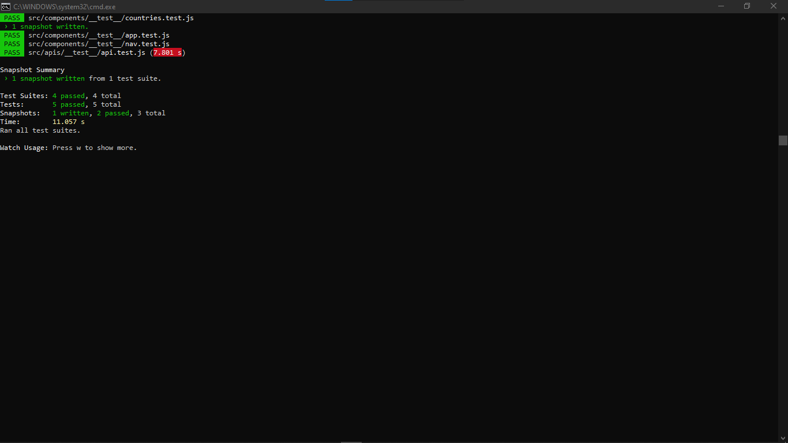

# Covid-19 world statistics

## Introduction

### About the requirements

> This project is the third Microverse program capstone (react&redux). It about build a React and Redux SPA showing the world statistics of covid-19 pandemic. Check out [here](https://www.loom.com/share/7b30fae4f1a449559e8c887d525ed83b) the video presentation for more details.

I had to put together all the knowledge I gained from the React/Redux module at Microverse in order to build this project in 5 working days. The project had to be API-based and the requirements included: 

### About the project

All data in this App are comming from [The covid19 tracking API](`https://api.covid19tracking.narrativa.com/api/).
It's a single page app called **Covid-19 world statistics** which allows the user to see all stats about the covid19 in any country all over the world.

As a user:
- I can see on the home page the list of countries and their cases number.
- When I click a country card, I'm taken to a page with the country's contamination details.

### Objectives
As a good learner in React and Redux, I had to learn how to build a SPA with React and Redux by:

- Build the project as a single page application (SPA) built with React and Redux.
- Retrieve the data from an API should be stored in the Redux store.
- Use a Filter stateless component to filter the data retrieved from the API.
- Use React Router so that every page should be accessible from a unique route.
- Deploy the project to make it accessible online;

## Live Demo

[Open the app](https://covid-19-world-statistics.netlify.app/)

## Getting Started

To get a local copy of this project running in development mode, follow the instructions below:: 

1. In your terminal, `cd` to the folder where you want to copy this project.
2. Type in `git clone git@github.com:Marcraphael12/Marc-react-capstone.git`
3. Then `cd capstone3-world-population`
4. Then `npm install` and wait for the installation to complete.
5. Finally run `npm start`(recommended) or `yarn start` if you're using yarn.
6. Open [http://localhost:3000](http://localhost:3000) to view it in the browser.

## Illustration

## Built With
-React Js
-Redux
-Sass

## Author

👤 **Marc Raphael**

- GitHub: [Marc Raphael](https://github.com/Marcraphael12)
- Twitter: [Marc Raphael](https://twitter.com/MarcRaphael20)
- LinkedIn: [Marc Raphael](https://www.linkedin.com/in/essogo-raphael/)

## 🤝 Contributing

Contributions, issues, and feature requests are welcome!

Feel free to check the [issues page](../../issues/).

## Show your support

Give a ⭐️ if you like this project!

## Acknowledgments

- Big thanks to [Microverse](https://www.microverse.org/) for the support and guidance.
- Special thanks to [Nelson Sakwa](https://www.behance.net/sakwadesignstudio) for the design inspiration

## 📝 License

This project is MIT licensed.